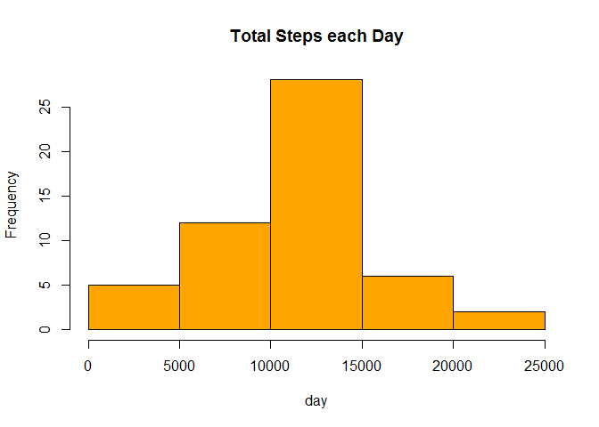
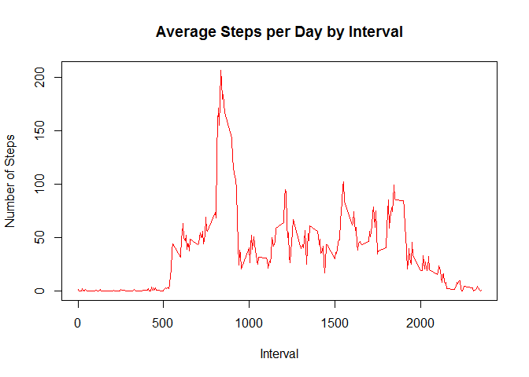
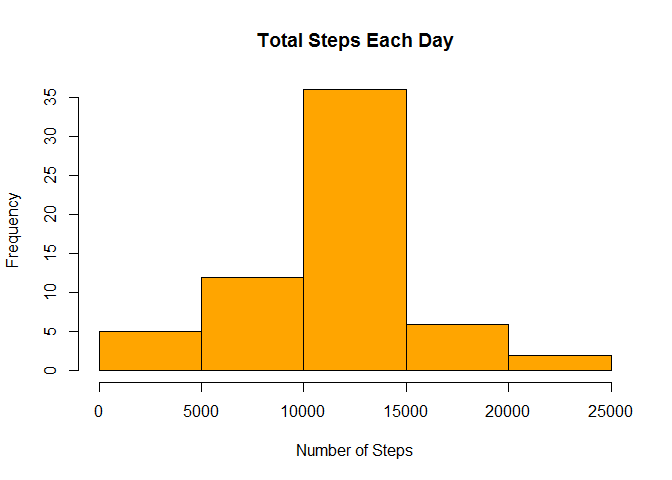
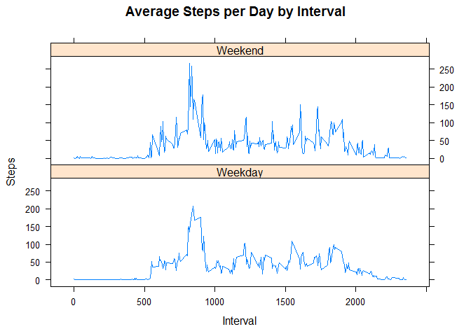

# Reproducible Research: Peer Assessment 1

## Loading and preprocessing the data
Here we load the data from "activity.csv"" file, and reformat the date column as PISOX date object, for further processing.


```r
data <- read.csv("activity.csv")
data$date <- as.POSIXct(paste(data$date), format="%Y-%m-%d")
```

Here we look at the data structure and a few rows of data.


```r
names(data)
```

```
## [1] "steps"    "date"     "interval"
```

```r
str(data)
```

```
## 'data.frame':	17568 obs. of  3 variables:
##  $ steps   : int  NA NA NA NA NA NA NA NA NA NA ...
##  $ date    : POSIXct, format: "2012-10-01" "2012-10-01" ...
##  $ interval: int  0 5 10 15 20 25 30 35 40 45 ...
```

```r
head(data)
```

```
##   steps       date interval
## 1    NA 2012-10-01        0
## 2    NA 2012-10-01        5
## 3    NA 2012-10-01       10
## 4    NA 2012-10-01       15
## 5    NA 2012-10-01       20
## 6    NA 2012-10-01       25
```

## What is mean total number of steps taken per day?
We generate a new dataset for aggregated total steps each day.

```r
data.steps_total <- aggregate(steps ~ date, data = data, sum, na.rm = TRUE)
```

And here is a histogram for total step taken each day:

```r
hist(data.steps_total$steps, main = "Total Steps each Day", xlab = "day", col = "orange")
```

 

The mean of steps taken each day is **10766** and median is **10765**.

## What is the average daily activity pattern?
Here we will geretae a dataset for avegare of each interval of the day.

```r
data.step_interval <- aggregate(steps ~ interval, data, mean)
```
And we plot the time seties for the average of steps for each interval.


```r
plot(data.step_interval$interval,data.step_interval$steps, type="l", xlab="Interval", ylab="Number of Steps",main="Average Steps per Day by Interval", col="red")
```

 


```r
# calc max interval of the day
interval_max <- data.step_interval[which.max(data.step_interval$steps),1]
```

Maximum interval from all days of given data is **835**.

## Imputing missing values
Here we impute missing values by inserting the average for each interval, from previously generated dataset.


```r
data.incomplete <- sum(!complete.cases(data))
data.imputed <- transform(data, steps = ifelse(is.na(data$steps), data.step_interval$steps[match(data$interval, data.step_interval$interval)], data$steps))
```

Now we will recalculate total steps by day and create histogram.


```r
data.steps_total_imputed <- aggregate(steps ~ date, data.imputed, sum)

hist(data.steps_total_imputed$steps, main = "Total Steps Each Day", col="orange", xlab="Number of Steps")
```

 

New mean for imputed data is **10766** and median is **10766**.
  
Calculating the difference in imputed and non-impurted data sets.

```r
mean_diff <- mean(data.steps_total_imputed$steps) - mean(data.steps_total$steps)
median_diff <- median(data.steps_total_imputed$steps) - median(data.steps_total$steps)
total_diff <- sum(data.steps_total_imputed$steps) - sum(data.steps_total$steps)
```
#### Differece of calculation of imputed and non-imputed data:
- Difference of means is **0**.
- Difference of medians is **1.1886792452824**.
- Differecne of total steps is **86129.5094339623'**.

## Are there differences in activity patterns between weekdays and weekends?
HEre we will create a plot to compare the weekdays and weekend activity using imputed dataset.


```r
weekdays <- c("Monday", "Tuesday", "Wednesday", "Thursday", "Friday")

data.imputed$weekday = as.factor(ifelse(is.element(weekdays(as.Date(data.steps_total_imputed$date)),weekdays), "Weekday", "Weekend"))

data.step_interval_imputed <- aggregate(steps ~ interval + weekday, data.imputed, mean)

library(lattice)

xyplot(data.step_interval_imputed$steps ~ data.step_interval_imputed$interval|data.step_interval_imputed$weekday, main="Average Steps per Day by Interval",xlab="Interval", ylab="Steps",layout=c(1,2), type="l")
```

 
